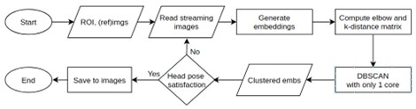
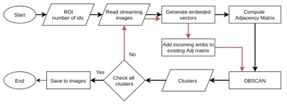

## FaceID system

This repo was heavily inspired from [FaceX-Zoo](https://github.com/JDAI-CV/FaceX-Zoo) which is a prevalent PyTorch toolbox for a wide range applications of face recognition. Here we publish some parts of our Face Recognition project, which encompasses training mode, inference mode and selecting mode. 

## Collecting mode
### One-in-one:
- The below flow chart is a demonstration of our first version (one id once). 



- We firstly select ROI then system automatically choose the reference face then start reading the streaming images from cameras.
- Deep learning models came into effect of faces detection and extraction.
- A tricky tuning of DBSCAN is to find the elbow point of the k-nearest neighbor line, but first of all, the k-distance and adj_matrix are also required.
- The core idea of this approach is to find all valid neighbors of the reference embedding inspired by DBSCAN. For more details, check the above link.
- Check whether the clustered images satisfy the specific pose condition or not.
Read more at [README.md](./collecting_data/ver_one/README.md).

### Some-in-one:



As all see in the first version, the main cons is on its name: one person at one time. Needed to devise a new version which fastens the sampling time 
such as simultaneously collecting faces of people front of the cameras.
- Firstly, select ROI and enter number of ids. 
- DBSCAN was used for clustering faces extracted from the camera.
- Check number of clusters, quality of each cluster (pose distribution)
- For each satisfied cluster, system would inform the one coresponding to that. This would stop until there is no invalid clusters.
- Read more at [README.md](./collecting_data/ver_two/README.md)

## Training mode
Best look at folder [conventional_training](FaceID/Face_KD/training_mode/conventional_training).

### Problems
Recent SOTA models perform impressively on public Benchmarks but it is still far away from using them directly in industry. These losses and models were designed for a large datasets only (some with hundred of million images), while our dataset length is just more or less than 50000 images. Directly fine-tuning SOTA models on such a small dataset would lead to overfit even with robust hyperspherical loss functions.  

### Solutions
After exploring several avenues, we opted for leveraging [Knowledge Distillation](https://arxiv.org/abs/1503.02531) to conduct generalization transfer between large models and smaller ones. We performed loads of experiments with some algorithms in advance, such as using a direct Pytorch built-in function at [train_kd.py](./Face_KD/training_mode/conventional_training/train_kd.py) or exploying [Deep Mutual Learning](https://openaccess.thecvf.com/content_cvpr_2018/papers/Zhang_Deep_Mutual_Learning_CVPR_2018_paper.pdf) at [train_dml_seq.py](./Face_KD/training_mode/conventional_training/train_dml_seq.py) / [train_dml_sync.py](./Face_KD/training_mode/conventional_training/train_dml_sync.py), but they seemed to pale in comparison to my ultimate approach: layer-specific Knowledge Distillation.

#### Setup 
- **Models and Weights**: both Teacher and Student could be any models. These models should be well initialized by FaceX-zoo pretrained models.
- **Transfer dataset**: 112x112 facial VTX dataset (onsize dataset, containing 50000 images).

#### Steps:
- **Teacher training**: A large size of the Teacher is preferable as we want to achieve a Teacher model performing the hightes accuracy on the VTX dataset. The backbone should be freezed (keep the pre-trained weights) and only set the parameters of the last layer (fully connected - FC) learnable. We need the informative logits of this FC layer for later logits matching using Kullback–Leibler (KL) loss.
- **Why not stop?**: Due to the inadequate sizes of large model and dataset, these Teachers tend to overfit the VTX dataset and performed poorly in practice. But their knowledge about VTX dataset is still valueable. For example, a classification problem with 3 classes: dog, chick, cat. If the dog is in the image, the label should be `[1, 0, 0]`, while the logit from the Teacher could be `[0.7, 0.05, 0.25]`. The Teacher wants to tell you that this dog is not like a chick but it can be more likely a cat. By matching the logits of the two models, the Student can actually learn some extra information rather than the groundtruth which helps it to further generalize.
- **Why early layers?**: :
    + For some very first layers, the output feature maps mainly contain very basic and general structures like vertices, edges or straight lights which usually is be the same for all models. Directly immiating the Teacher's early feature maps could be very beneficial for the Student.
    + Not to apply this to match so many layers, because we want the Student to be freedom and then can surpass the Teacher at the end.

- **Training KD**: gather three losses:
    + Logit matching loss: `kd_loss`
    + Early feature matching loss: `mse_loss`
    + Conventional classification loss: `cse_loss`

- To run: 

Check args at `train.sh` before running:
```shell
sh train.sh
```

## Testing mode
For practical use, we do not test our models on public Benchmark but on our own testing VTX dataset (containing 250,000 images of 455 classes). 
Every query and reference images are stored as 512-dimension vectors in `pickle` files. In accordance with the training loss, at inference phase, we ultilize 
Consine similarity, coupled with [Milvus engine](https://milvus.io/) for images similarity search. Detailed information could be found at [README.md](./milvus_search/README.md).

### Results:
We have not established a standard metric such as mAP, instead we tested our models with specific thresholds, which I believe more appropriate in practice. 
After choosing threshold such that `recall` equals or is greater than 99.99%, we report the `precision` as below.
| Model | Top K | Precision | Recall | 
| :-- | :-: | :-: | :-: |
| ResNet50 (Student) | 1 | 99.999% | 75.07% |
| ResNet50 (Student) | 3 | 99.997% | **77.21%** |
| Resnet50 (Pre-trained)| 1 | 99.99% | 54.75% |
| Resnet50 (Pre-trained)| 3 | 99.99% | 56.51% |
| ResNet100 (Student) | 1 | 99.999% | 79.12% |
| ResNet100 (Student) | 3 | 99.999% | **81.11%** |
| Resnet100 (Pre-trained)| 1 | 99.99% | 70.37% |
| Resnet100 (Pre-trained)| 3 | 99.99% | 77.20% |

For ResNet100 and ResNet50, we use pre-trained ResNet100 and ResNet50 as its teacher.
Increasing the threshold helps improve the `precision` but in turn decrease the `recall` as a trade-off.
Clearly, the best trade-off should be the model ResNet100 with `top_k` equals 3. 